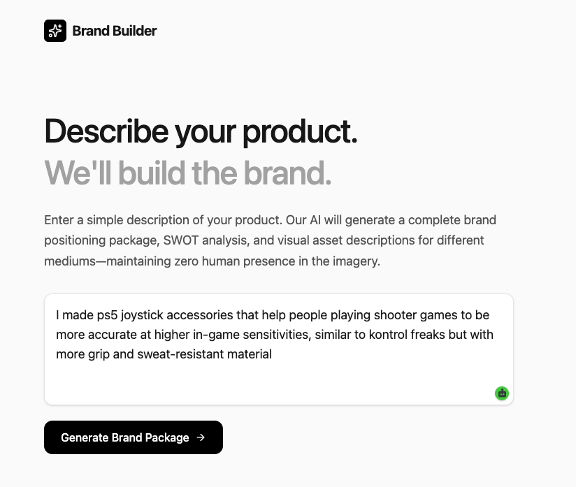
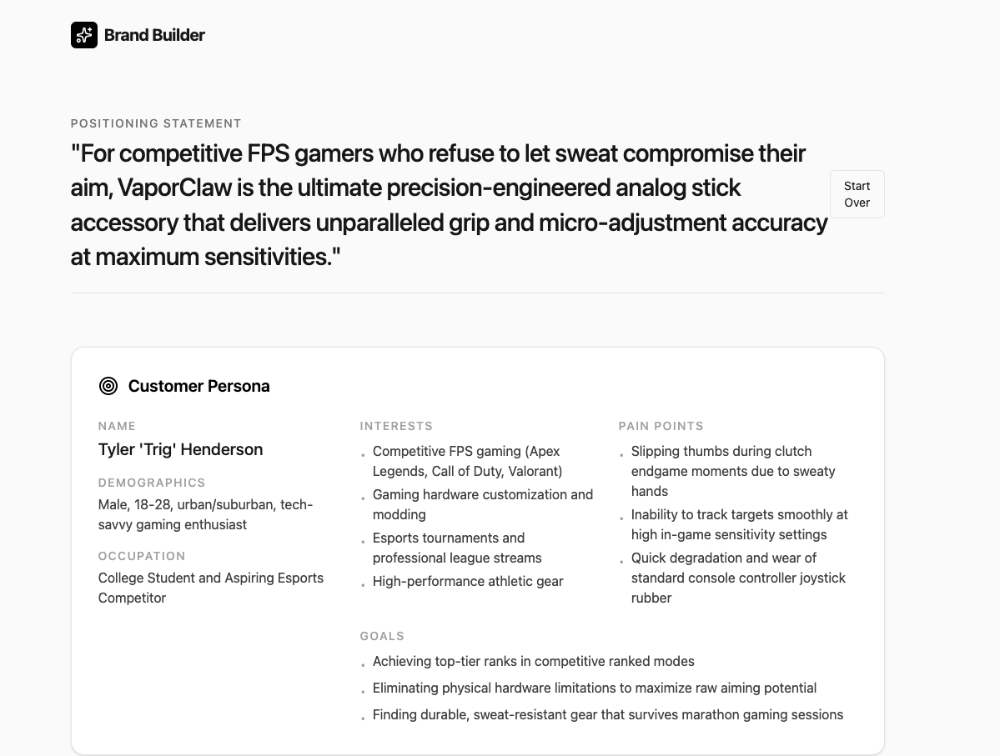

<div align="center">

</div>

# Product Ideation Assistant

An AI-powered product ideation and marketing concept generator designed to help businesses, entrepreneurs, marketers, and product teams rapidly visualize products across multiple marketing channels.

View the app in Google AI Studio:  
https://ai.studio/apps/e830756d-4bbf-4548-866e-3774e334bf44

---

## Project Demonstration

### Product Description Input

Users describe a product, target audience, or marketing concept they would like to explore.

The application gathers product information and prepares it for AI-powered ideation.



---

### Multi-Channel Marketing Concept Generation

The application generates marketing concepts across multiple channels while maintaining a consistent product identity and brand direction.



---

## Problem

Creating marketing concepts for a new product can be expensive, time-consuming, and difficult to visualize during the early stages of development.

Businesses often struggle to imagine how a product would appear across different marketing channels while maintaining a consistent brand identity.

This can slow down ideation, campaign planning, and product validation.

---

## Solution

The Product Ideation Assistant enables users to describe a product and instantly generate marketing concepts across multiple formats.

The application generates:

- Billboard concepts
- Newspaper advertisement concepts
- Social media campaign concepts
- Product positioning ideas
- Brand-aligned marketing outputs

The goal is to accelerate ideation and help users visualize products before investing significant resources into marketing development.

---

## Features

- AI-powered product ideation
- Multi-channel marketing concept generation
- Consistent branding across outputs
- Product positioning support
- Creative marketing exploration
- Rapid concept prototyping
- Prompt-driven workflows

---

## Example Workflow

### Input

> A premium insulated water bottle designed for outdoor enthusiasts and hikers.

### Output

- Billboard concept
- Print advertisement concept
- Social media campaign concept
- Product positioning recommendations
- Consistent branding across all outputs

This demonstrates how AI can rapidly transform a product idea into multiple marketing concepts.

---

## Tools Used

- Google AI Studio
- Gemini
- Claude
- ChatGPT
- Prompt Engineering
- Node.js
- JavaScript
- GitHub
- AI-Assisted Development

---

## What I Learned

Through this project I developed experience in:

### AI Workflow Design

- Designing AI-powered marketing workflows
- Structuring multi-output content generation systems
- Building user-focused ideation tools

### Prompt Engineering

- Maintaining output consistency across multiple formats
- Creating structured marketing prompts
- Improving AI-generated creative outputs through iteration

### Product & Marketing Strategy

- Product positioning
- Brand consistency
- Marketing concept development
- Audience-focused messaging

### Product Thinking

- Translating business challenges into AI-powered solutions
- Designing applications around user workflows
- Rapid prototyping and testing

### AI-Assisted Development

- Using generative AI to accelerate development
- Iterative refinement through AI collaboration
- Building practical AI business applications

---

## Potential Use Cases

### Entrepreneurs

- Product validation
- Brand exploration
- Campaign planning

### Marketing Teams

- Creative ideation
- Campaign development
- Multi-channel planning

### Product Teams

- Product positioning
- Messaging development
- Concept visualization

### Agencies

- Rapid concept generation
- Creative brainstorming
- Client workshops

---

## Future Improvements

- AI image generation
- Brand guideline uploads
- Campaign calendar generation
- Exportable concept reports
- Team collaboration features
- Presentation generation

---

## Run Locally

### Prerequisites

- Node.js

### Installation

Install dependencies:

```bash
npm install
```

Create a `.env.local` file and add your Gemini API key:

```env
GEMINI_API_KEY=YOUR_API_KEY_HERE
```

Start the development server:

```bash
npm run dev
```

---

## Project Structure

```text
Product-Ideation-Assistant/
│
├── ProductIdeation1.png
├── ProductIdeation2.png
├── src/
├── public/
├── README.md
└── package.json
```

---

## Disclaimer

This project was developed as a personal learning project focused on AI-assisted product ideation, marketing workflows, prompt engineering, and practical business applications of generative AI.

---

## Author

### Alexandre Folliet

Business Analytics Student  
Interested in AI, Product Operations, Growth Strategy, Business Analytics, Marketing Innovation, and Digital Product Development.

GitHub: https://github.com/afolliet
